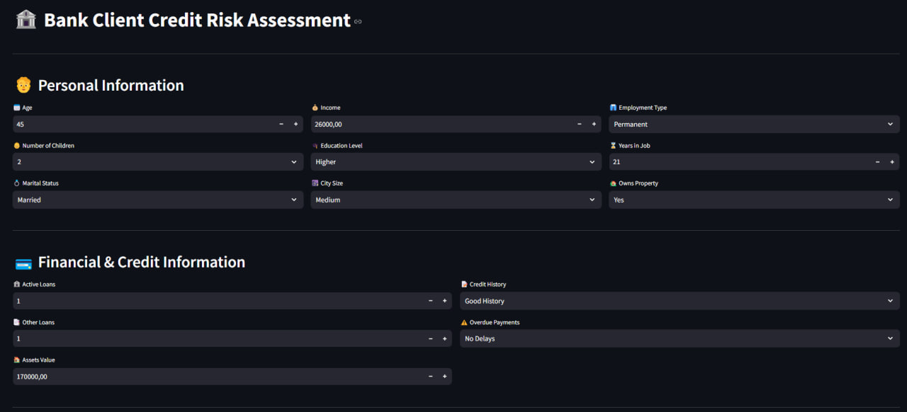
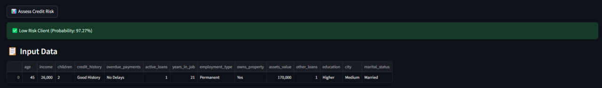
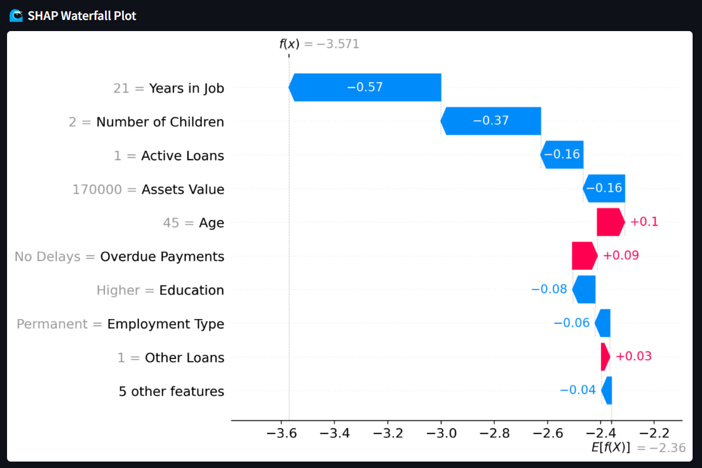

# Client Classifier

A machine learning application for classifying clients based on their features.

## Features
- Predicts client categories based on input data.
- Deployable via Docker or locally using Python.
- Simple REST API for model inference.

## Example Usage





## Installation

### Running with Docker 

```bash
docker pull davydantoniuk/credit-bank-classifier
```

```bash
docker run -p 8501:8501 davydantoniuk/credit-bank-classifier
```

Open your browser and navigate to `http://localhost:8501`.

### Running Locally

```bash
git clone https://github.com/davydantoniuk/credit-risk-classifier
cd credit-risk-classifier/app
```

If necessary, create a virtual environment and activate it.

```bash
python -m venv venv
venv\Scripts\activate # source venv/bin/activate
```

```bash
pip install -r requirements.txt
```

```bash
streamlit run app.py
```